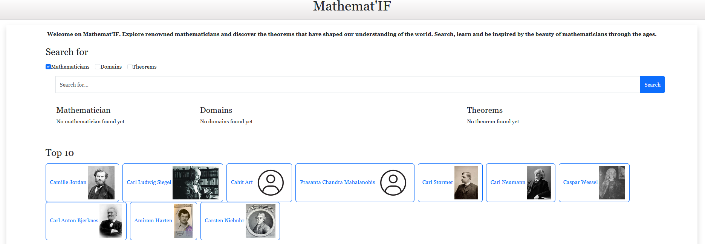

# MathematIF

MathematIF is an Angular application that provides access to mathematical content, including mathematicians, fields, and theorems. The app leverages DBpedia and Wikidata to fetch data about prominent mathematicians, mathematical fields, and famous theorems.

## Application Screenshots

Below are some screenshots showcasing the **MathematIF** application:

- **Home Page**: The main page of the application, featuring a search bar to look up mathematicians and a curated list of the top 10 mathematicians.

  

- **Description Page**: A typical description page for a mathematician, displaying detailed information along with related mathematical fields and theorems.

  

## Prerequisites

Before getting started, ensure you have the following installed:

- [Node.js](https://nodejs.org/) (v16 or higher)
- [npm](https://www.npmjs.com/) (Node package manager)
- [Angular CLI](https://angular.io/cli) version 16.2.8 or later

## Installation

1. Clone the repository:

   ```bash
   git clone <repository-url>
   cd mathematicIF
   ```

2. Install the necessary dependencies:

   ```bash
   npm install
   ```

## Development Server

To start the development server, run:

```bash
ng serve
```

The application will be available at `http://localhost:4200/`. Any changes to the source files will automatically trigger a reload of the app.

## API Queries

The app utilizes the following queries to fetch data from DBpedia and Wikidata:

### 1. **Search Mathematician**

Query to search for mathematicians by name. It fetches the name, image, birth date, and death date:

```sql
SELECT DISTINCT ?name ?img ?dateNaissance ?dateMort WHERE {
  {?m a yago:Mathematician110301261}
  UNION
  {?m dbo:mainInterest dbr:Mathematics}
  UNION
  {?m dbp:field dbr:Mathematics}
  UNION
  {?m dbp:mainInterests dbr:Islamic_mathematics}
  ?m a foaf:Person.
  ?m dbp:name ?name
  FILTER ( regex(?name, "^(?=.*'+input+').*", "i") )
  OPTIONAL {?m dbo:thumbnail ?img}
  OPTIONAL {?m dbo:birthDate ?dateNaissance}
  OPTIONAL {?m dbo:deathDate ?dateMort}
}
```

### 2. **Search Field**

Query to search for mathematical fields by name:

```sql
SELECT DISTINCT ?field ?nom ?description (GROUP_CONCAT(DISTINCT ?image; SEPARATOR=" | ") as ?images) 
FROM { ?field wdt:P31 wd:Q1936384. SERVICE wikibase:label { bd:serviceParam wikibase:language "en". ?field rdfs:label ?nom. ?field schema:description ?description. } }
...
```

### 3. **Search Theorem**

Query to search for theorems by name (e.g., Pythagorean theorem):

```sql
SELECT DISTINCT ?theorem ?nom (GROUP_CONCAT(DISTINCT ?image; SEPARATOR=" | ") as ?images) 
WHERE {
  ?theorem wdt:P31 wd:Q65943.
  SERVICE wikibase:label { bd:serviceParam wikibase:language "en". ?theorem rdfs:label ?nom. }
  OPTIONAL {?theorem wdt:P18 ?image.}
  FILTER(regex(?nom, "^(?=.*pythagore).*", "i"))
}
```

### 4. **Mathematician Detail**

Fetch detailed information about a specific mathematician:

```sql
SELECT DISTINCT ?name AS ?nom ?description ?dateNaissance ?dateMort ?nationalite
WHERE {
  {?m a yago:Mathematician110301261} 
  ...
}
```

### 5. **Theorem Detail**

Fetch detailed information about a specific theorem:

```sql
SELECT DISTINCT ?theorem ?nom ?description (GROUP_CONCAT(DISTINCT ?formula; SEPARATOR=" £ ") as ?formulas) 
FROM {
  ?theorem wdt:P31 wd:Q65943.
  ...
}
```

## Directory Structure

The project directory follows a basic Angular structure:

```bash
src/
  app/
    components/
      searchbar/
      mathematician/
      field/
      theorem/
    services/
      api.service.ts
    models/
      mathematician.model.ts
      field.model.ts
      theorem.model.ts
  assets/
    images/
  environments/
    environment.ts
```

- **Components:** Contains components for the search bar, mathematician, field, and theorem views.
- **Services:** Contains the `ApiService` for handling API requests.
- **Models:** Contains the TypeScript models for mathematicians, fields, and theorems.

## Running Tests

To run the unit tests for this project, use the Angular CLI:

```bash
ng test
```

## Further Help

For more information on Angular CLI commands, use:

```bash
ng help
```

Or visit the [Angular CLI Overview and Command Reference](https://angular.io/cli) page.
